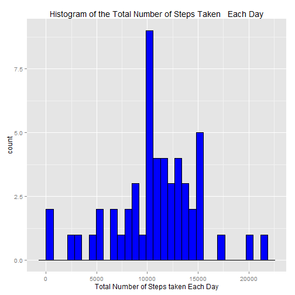
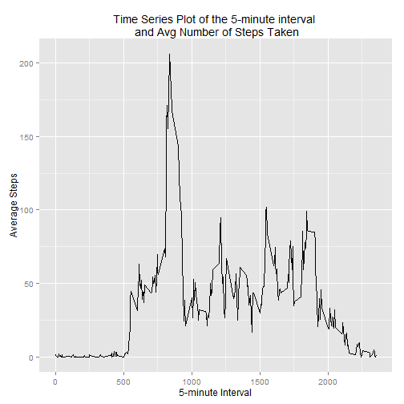
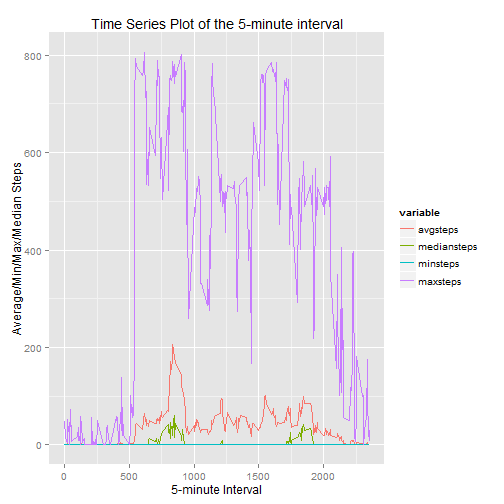
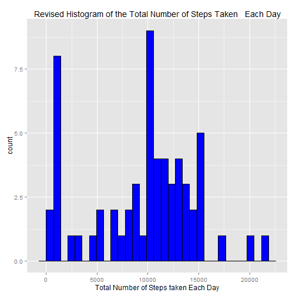
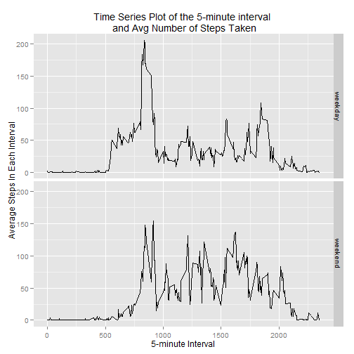

#Reproducible Research Assessment 1

```r
library(psych)
library(plyr)
library(ggplot2)
library(reshape2)
library(knitr)
```

##Loading and preprocessing the data
Show any code that is needed to Load the data (i.e. read.csv()).
Process/transform the data (if necessary) into a format suitable for your analysis.

```r
df_act <- read.csv("./activity.csv")
df_act$date = as.Date(df_act$date)
```

##What is mean total number of steps taken per day?
For this part of the assignment, you can ignore the missing values in the dataset.
Make a histogram of the total number of steps taken each day
Calculate and report the mean and median total number of steps taken per day.

```r
#remove missing values
df_act1 <- na.omit(df_act)

#Calculate the total number steps taken per day
df_act2 <- ddply(df_act1, .(date), summarize, sumsteps = sum(steps))

#histogram
ggplot (df_act2, aes(sumsteps)) + ggtitle("Histogram of the Total Number of Steps Taken   Each Day") + xlab("Total Number of Steps taken Each Day") + geom_histogram(colour="black", fill="blue")
```

 

```r
#Get a description of the data
describe (df_act2$sumsteps)
```

```
##   vars  n  mean   sd median trimmed  mad min   max range skew kurtosis
## 1    1 53 10766 4269  10765   10940 3140  41 21194 21153 -0.3     0.59
##      se
## 1 586.4
```

```r
#calculate the mean and median
meansteps <- mean(df_act2$sumsteps)
mediansteps <- median(df_act2$sumsteps)
print (paste("Mean total number of steps taken per day = ", meansteps))
```

```
## [1] "Mean total number of steps taken per day =  10766.1886792453"
```

```r
print (paste("Median total number of steps taken per day = ", mediansteps))
```

```
## [1] "Median total number of steps taken per day =  10765"
```

##What is the average daily activity pattern?
Make a time series plot (i.e. type = "l") of the 5-minute interval (x-axis) and
the average number of steps taken, averaged across all days (y-axis).
Which 5-minute interval, on average across all the days in the dataset,
contains the maximum number of steps?


```r
#Calculate the average number steps taken for each interval across dates
df_act3 <- ddply(df_act1, .(interval), summarize, avgsteps = mean(steps), mediansteps = median(steps), minsteps = min(steps), maxsteps = max(steps))

#Time series plot
ggplot(df_act3, aes(interval, avgsteps)) + geom_line() + 
       xlab("5-minute Interval") + ylab("Average Steps") +
       ggtitle ("Time Series Plot of the 5-minute interval \n and Avg Number of Steps Taken")
```

 

```r
#Interval with max number of steps on avg across days
maxstepinterval <- df_act3$interval[which.max(df_act3$avgsteps)]
print (paste("Interval with max number of steps on avg across days is ", maxstepinterval))
```

```
## [1] "Interval with max number of steps on avg across days is  835"
```

##Imputing missing values

Note that there are a number of days/intervals where there are missing values
(coded as NA). The presence of missing days may introduce bias into some
calculations or summaries of the data.

Calculate and report the total number of missing values in the dataset (i.e.
the total number of rows with NAs).

Devise a strategy for filling in all of the missing values in the dataset. The
strategy does not need to be sophisticated. For example, you could use the
mean/median for that day, or the mean for that 5-minute interval, etc.

Create a new dataset that is equal to the original dataset but with the missing
data filled in.

Make a histogram of the total number of steps taken each day and Calculate and
report the mean and median total number of steps taken per day. Do these values
differ from the estimates from the first part of the assignment? What is the
impact of imputing missing data on the estimates of the total daily number of
steps?


```r
#Total numbers of rows with NAs
numincomplrows <- sum(!complete.cases(df_act))
print (paste("The total number of rows with NAs = ", numincomplrows))
```

```
## [1] "The total number of rows with NAs =  2304"
```

```r
#Time series plot - plot by interval the avg, min, max, median to see what is a good strategy
meltdf <- melt(df_act3,id="interval")
ggplot(meltdf, aes(x=interval,y=value,colour=variable,group=variable)) + geom_line() + 
  xlab("5-minute Interval") + ylab("Average/Min/Max/Median Steps") +
  ggtitle ("Time Series Plot of the 5-minute interval")
```

 

```r
#strategy
print("Use the median value for the interval to fill NA values as significant outliers are pulling up the average")
```

```
## [1] "Use the median value for the interval to fill NA values as significant outliers are pulling up the average"
```

```r
#new data set with missing data filled in
df_act4 <- df_act

for (i in 1:length(df_act4$steps)) {
  if (is.na(df_act4$steps[i])) {
    interval <- df_act4$interval[i]
    df_act4$steps[i] <- df_act3$mediansteps[which(df_act3$interval == interval)]
  }
}

#check if any has missing data
which(is.na(df_act4$steps))
```

```
## integer(0)
```

```r
#Calculate the total number steps taken per day
df_act5 <- ddply(df_act4, .(date), summarize, sumsteps = sum(steps))

#histogram
ggplot (df_act5, aes(sumsteps)) + ggtitle("Revised Histogram of the Total Number of Steps Taken   Each Day") + xlab("Total Number of Steps taken Each Day") + geom_histogram(colour="black", fill="blue")
```

 

```r
#Get a description of the data
describe (df_act5$sumsteps)
```

```
##   vars  n mean   sd median trimmed  mad min   max range  skew kurtosis
## 1    1 61 9504 5151  10395    9593 4532  41 21194 21153 -0.27    -0.55
##      se
## 1 659.5
```

```r
#calculate the mean and median
meansteps2 <- mean(df_act5$sumsteps)
mediansteps2 <- median(df_act5$sumsteps)
print (paste("Revised Mean total number of steps taken per day = ", meansteps2))
```

```
## [1] "Revised Mean total number of steps taken per day =  9503.86885245902"
```

```r
print (paste("Revised Median total number of steps taken per day = ", mediansteps2))
```

```
## [1] "Revised Median total number of steps taken per day =  10395"
```

```r
#comparing to previous part
print (paste("Revised Mean total number of steps taken per day = ", meansteps2, "is lower to as compared to original", meansteps))
```

```
## [1] "Revised Mean total number of steps taken per day =  9503.86885245902 is lower to as compared to original 10766.1886792453"
```

```r
print (paste("Revised Median total number of steps taken per day = ", mediansteps2, "is lower to as compared to original", mediansteps))
```

```
## [1] "Revised Median total number of steps taken per day =  10395 is lower to as compared to original 10765"
```

##Are there differences in activity patterns between weekdays and weekends?

For this part the weekdays() function may be of some help here. Use the dataset
with the filled-in missing values for this part.

Create a new factor variable in the dataset with two levels - "weekday" and
"weekend" indicating whether a given date is a weekday or weekend day.

Make a panel plot containing a time series plot (i.e. type = "l") of the
5-minute interval (x-axis) and the average number of steps taken, averaged
across all weekday days or weekend days (y-axis).


```r
#create new factor variable using filled-in missing values
df_act4$weekday <- weekdays(as.Date(df_act4$date))
df_act4$daytype <- as.factor(ifelse (df_act4$weekday %in% c("Saturday", "Sunday"), "weekend", "weekday"))
table(df_act4$daytype)
```

```
## 
## weekday weekend 
##   12960    4608
```

```r
df_act6 <- ddply(df_act4, .(interval, daytype), summarize, avgsteps = mean(steps))

#Time series plot
ggplot(df_act6, aes(interval, avgsteps)) + geom_line() + 
  xlab("5-minute Interval") + ylab("Average Steps In Each Interval") + facet_grid(daytype ~ .) +
  ggtitle ("Time Series Plot of the 5-minute interval \n and Avg Number of Steps Taken")
```

 
